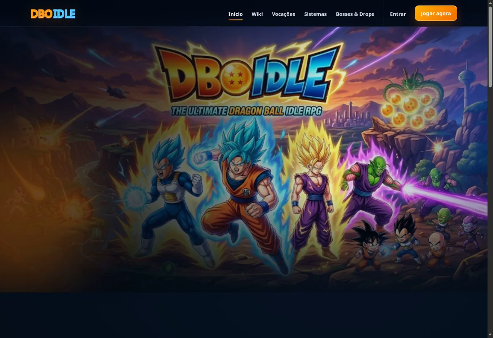
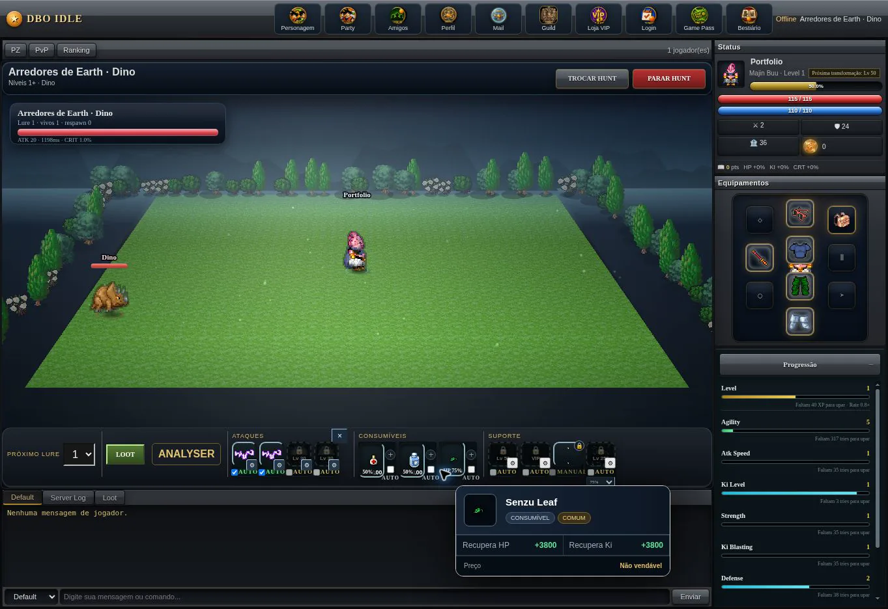
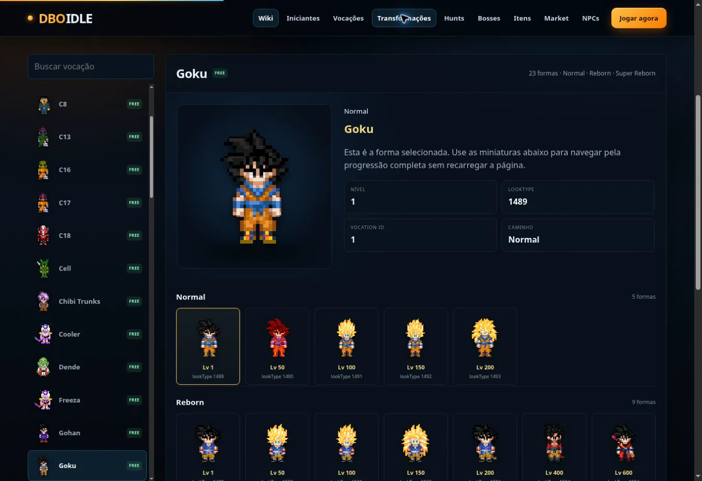
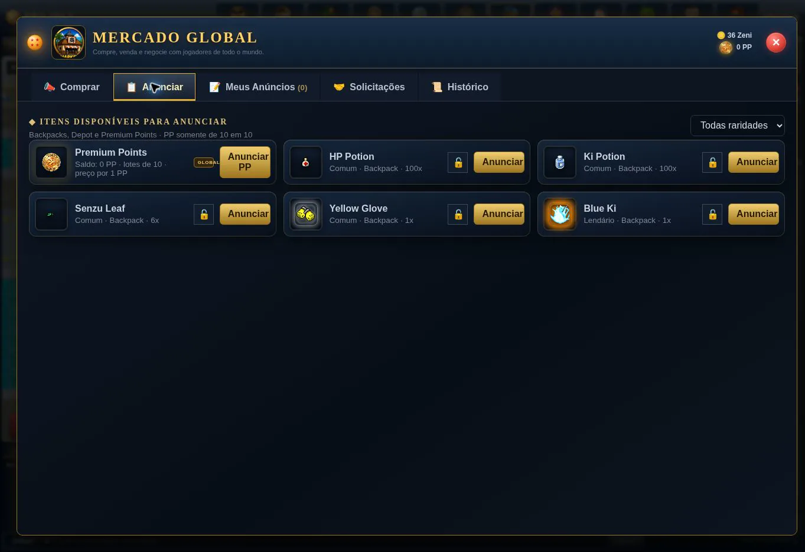
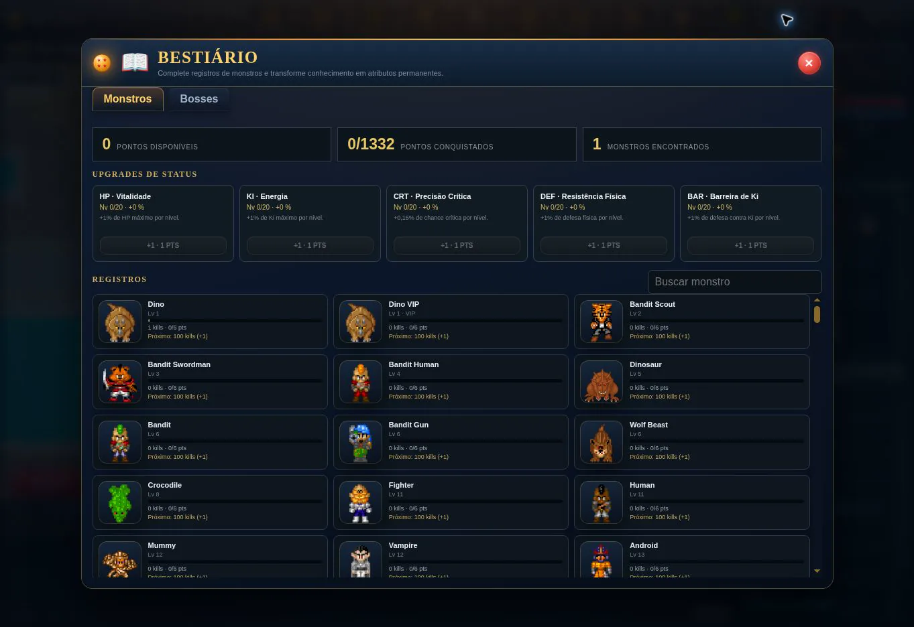
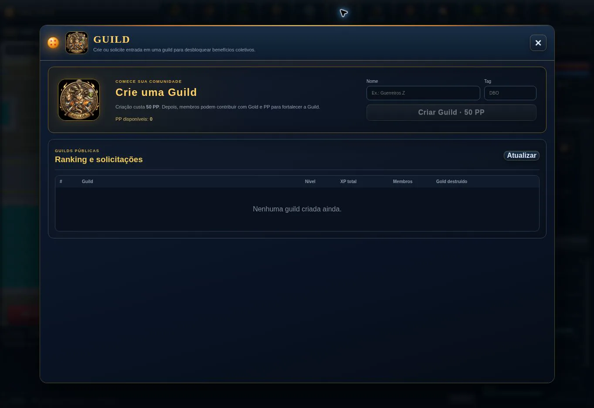
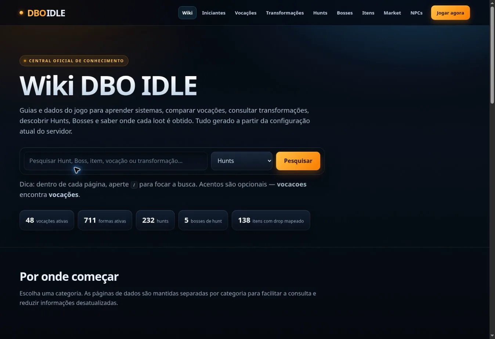
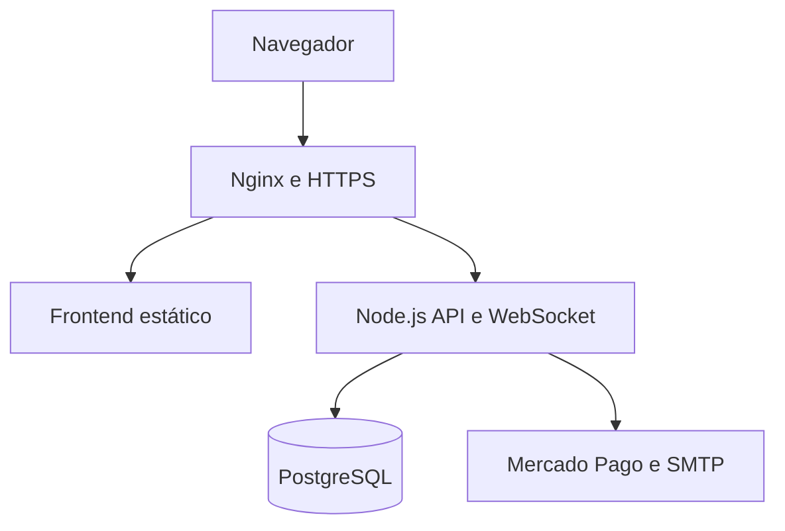

# DBO IDLE

Estudo de caso full stack de um RPG idle multiplayer desenvolvido para navegador.

O projeto reuniu frontend em JavaScript, backend Node.js, comunicação em tempo real com WebSocket, persistência em PostgreSQL, pagamentos com Mercado Pago e operação em uma VPS Linux. Esta versão pública foi preparada exclusivamente para portfólio e contém documentação e trechos selecionados do código de produção.

> Snapshot técnico preservado em 30 de agosto de 2026: servidor `21.26.4` e cliente `22.4.4`.

| Recorte público | Resultado |
|---|---:|
| Linhas de código selecionadas | 22.412 |
| Arquivos de código de produção | 56 |
| Módulos frontend demonstrados | 41 |
| Módulos JavaScript do backend | 13 |

## Demonstração visual

▶️ **[Assistir ao vídeo de demonstração](docs/media/DBO-IDLE-demonstracao-tecnica.mp4)** — 1 minuto e 5 segundos, Full HD, sem áudio.

| Gameplay e hunts | Transformações |
|---|---|
|  |  |

| Mercado global | Bestiário |
|---|---|
|  |  |

| Guildas | Wiki integrada |
|---|---|
|  |  |

## Minha atuação

Atuei no planejamento, desenvolvimento, integração, implantação e evolução contínua do produto, incluindo:

- desenvolvimento da interface e dos motores de gameplay;
- criação da API, autenticação, persistência e comunicação WebSocket;
- modelagem e manutenção do banco PostgreSQL;
- integração de PIX e cartão com Mercado Pago;
- administração de VPS Ubuntu com Nginx, PM2, SSL, firewall e backups;
- balanceamento de progressão, economia, equipamentos e recompensas;
- manutenção da Wiki, experiência do usuário e processo de publicação.

## Arquitetura

| Camada | Tecnologias | Responsabilidade |
|---|---|---|
| Interface | HTML, CSS e JavaScript ES Modules | Renderização, interação e motores do cliente |
| Tempo real | WebSocket | Estado online, party, PvP e eventos de gameplay |
| Backend | Node.js | API, autenticação e autoridade do servidor |
| Dados | PostgreSQL | Contas, personagens, mercado, guildas e pagamentos |
| Infraestrutura | Ubuntu, Nginx e PM2 | HTTPS, proxy reverso e operação do processo |
| Integrações | Mercado Pago e SMTP | Pagamentos, webhooks e verificação por e-mail |

Mais detalhes em [Arquitetura](docs/ARCHITECTURE.md).

## Sistemas implementados

- contas, sessões, verificação de e-mail e recuperação de senha;
- criação de personagens, vocações, transformações e reborn;
- hunts, monstros, bosses, magias e progressão offline;
- inventário, containers, equipamentos, raridade e auto-loot;
- bestiário, quests, treinamento e passe de batalha;
- party, PvP, guildas, rankings e bosses de guilda;
- market entre jogadores, moedas e economia virtual;
- mailbox para comunicados, presentes e recompensas;
- pagamentos com reconciliação e validação de webhook;
- Wiki e ferramentas internas de edição e auditoria.

Consulte o [mapa de funcionalidades](docs/FEATURES.md) para relacionar cada área aos módulos demonstrativos.

## Onde começar a leitura do código

| Tema | Arquivo |
|---|---|
| Autoridade de gameplay | [server-authority.js](source-excerpts/backend/src/server-authority.js) |
| Persistência e regras transacionais | [database.js](source-excerpts/backend/src/database.js) |
| API e webhooks | [api.js](source-excerpts/backend/src/api.js) |
| Pagamentos | [payments.js](source-excerpts/backend/src/payments.js) |
| PvP em tempo real | [pvp.js](source-excerpts/backend/src/pvp.js) |
| Cliente WebSocket | [socket-client.js](source-excerpts/frontend/src/core/network/socket-client.js) |
| Motor de hunts | [hunt-engine.js](source-excerpts/frontend/src/core/hunt/hunt-engine.js) |
| Transformações | [transformation-engine.js](source-excerpts/frontend/src/core/transformations/transformation-engine.js) |
| Inventário e containers | [containers.js](source-excerpts/frontend/src/core/inventory/containers.js) |
| Balanceamento | [absolute-balance-engine.js](source-excerpts/frontend/src/core/balance/absolute-balance-engine.js) |

## Escopo deste repositório

Este é um repositório de demonstração técnica, não uma distribuição executável do jogo. Foram deliberadamente excluídos:

- credenciais, arquivos `.env` e configurações de produção;
- banco de dados, contas, personagens, logs e informações de jogadores;
- sprites, mapas, sons, clientes e outros recursos de terceiros;
- catálogos gerados, backups, arquivos de implantação e código duplicado;
- regras de conteúdo necessárias para reconstruir o jogo completo.

Os trechos em [`source-excerpts`](source-excerpts/README.md) preservam a estrutura e o estilo do código implantado, mas algumas importações apontam para conteúdos omitidos por segurança e propriedade intelectual.

## Documentação

- [Arquitetura](docs/ARCHITECTURE.md)
- [Funcionalidades e módulos](docs/FEATURES.md)
- [Decisões técnicas e trade-offs](docs/TECHNICAL-DECISIONS.md)
- [Relatório de preparação pública](docs/AUDIT-REPORT.md)
- [Roteiro para screenshots e vídeo](docs/SCREENSHOTS.md)
- [Avisos de propriedade intelectual](NOTICE.md)

## Status

O ambiente de produção está em processo de encerramento. A versão final, o banco e as configurações foram preservados em backup privado com verificação SHA-256. Este repositório permanece como registro técnico do projeto.

## Aviso

Projeto independente, criado para fins educacionais e de portfólio, sem vínculo oficial com as franquias que serviram como inspiração. Marcas, personagens e recursos de terceiros pertencem aos respectivos titulares e não são distribuídos neste repositório.
