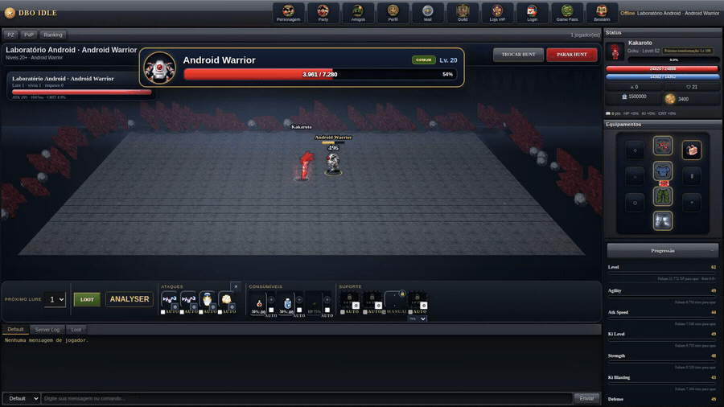
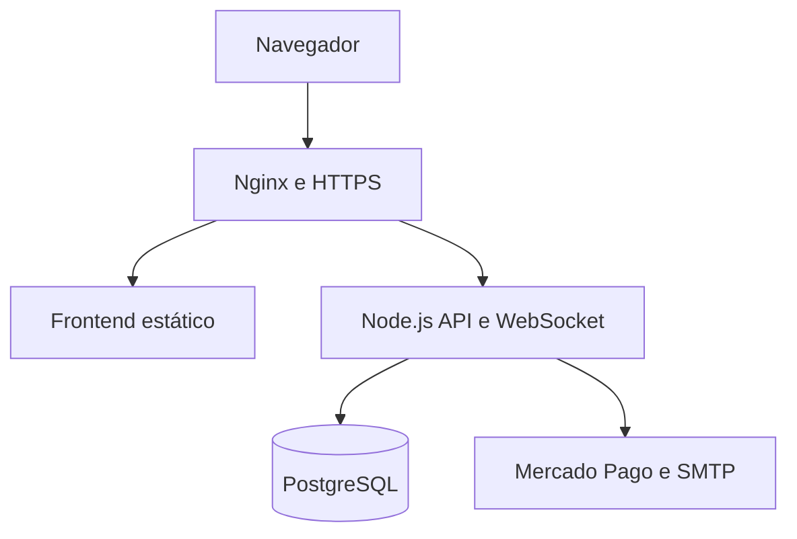

# DBO IDLE

**[▶ Jogar agora](https://alanfmf.github.io/dbo-idle-play/play/)** · [Wiki do jogo](https://alanfmf.github.io/dbo-idle-play/wiki/) · [Vídeo de demonstração](docs/media/DBO-IDLE-demonstracao-tecnica.mp4)

Estudo de caso full stack de um RPG idle multiplayer desenvolvido para navegador.

O projeto reuniu frontend em JavaScript, backend Node.js, comunicação em tempo real com WebSocket, persistência em PostgreSQL, pagamentos com Mercado Pago e operação em uma VPS Linux. Esta versão pública foi preparada para portfólio e reúne a documentação, o esquema do banco e trechos selecionados do código de produção.

> Snapshot técnico preservado em 30 de agosto de 2026: servidor `21.26.4` e cliente `22.4.4`.

## Operação real

Números medidos na VPS com o sistema no ar, ao final de um piloto fechado de 15 dias. Nenhum é estimativa.

| Tráfego e processo | |
|---|---:|
| Requisições HTTP atendidas | 64.417 |
| Tempo de resposta — mediana | 58 ms |
| Tempo de resposta — mínimo / máximo | 42 ms / 195 ms |
| Conexões WebSocket estabelecidas (HTTP 101) | 163 |
| Respostas servidas do cache (HTTP 304) | 12.257 |
| Memória do processo Node | 76 MB |
| Reinícios instáveis do processo | 0 |

| Banco de dados | |
|---|---:|
| Tabelas | 20 |
| Colunas | 223 |
| Chaves estrangeiras | 33 |
| Constraints CHECK | 42 |
| Índices explícitos | 25 |
| Eventos de segurança registrados | 576 |

O servidor ficou exposto na internet pública e recebeu varredura automatizada desde o primeiro dia — a rota mais requisitada de toda a operação foi `/wp-admin/install.php`, com 4.371 tentativas. Detalhamento completo, incluindo os casos em que a autoridade do servidor e a validação de pagamento barraram estado inválido, em [Métricas de produção](docs/METRICS.md).

## Demonstração visual

▶️ **[Vídeo de demonstração completo](docs/media/dbo-idle-demonstracao.mp4)** — 4 min 53 s, percorrendo interface, seleção de hunts, combate, transformação e progressão.
▶️ **[Recorte técnico](docs/media/DBO-IDLE-demonstracao-tecnica.mp4)** — 1 min 05 s, Full HD, sem áudio.

| Combate | Transformação |
|---|---|
|  |  |

| Mundo e mapa | Seleção de hunts |
|---|---|
|  |  |

| Inventário e raridade | Bestiário |
|---|---|
|  |  |

| Hunt Analyser | Criação de personagem |
|---|---|
|  |  |

| Mercado entre jogadores | Wiki integrada |
|---|---|
|  |  |

Demais telas

| | | |
|---|---|---|
|  |  |  |
|  |  |  |
|  |  |  |
|  |  |  |
|  |  |  |
|  |  |  |
|  |  |  |

> Parte das capturas foi feita na build estática do cliente, rodando sem servidor: nessas telas, guilda, mercado, party e PvP aparecem vazios. As versões com dados vieram do ambiente de produção, em conta criada só para demonstração. O índice completo está em [Screenshots](docs/SCREENSHOTS.md).

## Minha atuação

Atuei no planejamento, desenvolvimento, integração, implantação e evolução contínua do produto, incluindo:

- desenvolvimento da interface e dos motores de gameplay;
- criação da API, autenticação, persistência e comunicação WebSocket;
- modelagem e manutenção do banco PostgreSQL;
- integração de PIX e cartão com Mercado Pago;
- administração de VPS Ubuntu com Nginx, PM2, SSL, firewall e backups;
- balanceamento de progressão, economia, equipamentos e recompensas;
- manutenção da Wiki, experiência do usuário e processo de publicação.

## Arquitetura

| Camada | Tecnologias | Responsabilidade |
|---|---|---|
| Interface | HTML, CSS e JavaScript ES Modules | Renderização, interação e motores do cliente |
| Tempo real | WebSocket | Estado online, party, PvP e eventos de gameplay |
| Backend | Node.js | API, autenticação e autoridade do servidor |
| Dados | PostgreSQL | Contas, personagens, mercado, guildas e pagamentos |
| Infraestrutura | Ubuntu, Nginx e PM2 | HTTPS, proxy reverso e operação do processo |
| Integrações | Mercado Pago e SMTP | Pagamentos, webhooks e verificação por e-mail |

Detalhes em [Arquitetura](docs/ARCHITECTURE.md) e, no lado da operação, em [Infraestrutura](docs/INFRASTRUCTURE.md).

## Sistemas implementados

- contas, sessões, verificação de e-mail e recuperação de senha;
- criação de personagens, vocações, transformações e reborn;
- hunts, monstros, bosses, magias e progressão offline;
- inventário, containers, equipamentos, raridade e auto-loot;
- bestiário, quests, treinamento e passe de batalha;
- party, PvP, guildas, rankings e bosses de guilda;
- market entre jogadores, moedas e economia virtual;
- mailbox para comunicados, presentes e recompensas;
- pagamentos com reconciliação e validação de webhook;
- Wiki e ferramentas internas de edição e auditoria.

Consulte o [mapa de funcionalidades](docs/FEATURES.md) para relacionar cada área aos módulos demonstrativos.

## Onde começar a leitura do código

| Tema | Arquivo |
|---|---|
| Autoridade de gameplay | [server-authority.js](source-excerpts/backend/src/server-authority.js) |
| Persistência e regras transacionais | [database.js](source-excerpts/backend/src/database.js) |
| API e webhooks | [api.js](source-excerpts/backend/src/api.js) |
| Pagamentos | [payments.js](source-excerpts/backend/src/payments.js) |
| PvP em tempo real | [pvp.js](source-excerpts/backend/src/pvp.js) |
| Cliente WebSocket | [socket-client.js](source-excerpts/frontend/src/core/network/socket-client.js) |
| Motor de hunts | [hunt-engine.js](source-excerpts/frontend/src/core/hunt/hunt-engine.js) |
| Transformações | [transformation-engine.js](source-excerpts/frontend/src/core/transformations/transformation-engine.js) |
| Inventário e containers | [containers.js](source-excerpts/frontend/src/core/inventory/containers.js) |
| Balanceamento | [absolute-balance-engine.js](source-excerpts/frontend/src/core/balance/absolute-balance-engine.js) |
| Esquema do banco | [SCHEMA.sql](docs/SCHEMA.sql) |

## Escopo deste repositório

Este é um repositório de demonstração técnica, não uma distribuição executável do jogo. O recorte público reúne 56 arquivos de código de produção, com 22.412 linhas. Foram deliberadamente excluídos:

- credenciais, arquivos `.env` e configurações de produção;
- banco de dados, contas, personagens, logs e informações de jogadores;
- sprites, mapas, sons, clientes e outros recursos de terceiros;
- catálogos gerados, backups, arquivos de implantação e código duplicado;
- regras de conteúdo necessárias para reconstruir o jogo completo.

Os trechos em [`source-excerpts`](source-excerpts/README.md) preservam a estrutura e o estilo do código implantado, mas algumas importações apontam para conteúdos omitidos por segurança e propriedade intelectual.

## Documentação

- [Métricas de produção](docs/METRICS.md)
- [Infraestrutura e operação](docs/INFRASTRUCTURE.md)
- [Arquitetura](docs/ARCHITECTURE.md)
- [Funcionalidades e módulos](docs/FEATURES.md)
- [Decisões técnicas e trade-offs](docs/TECHNICAL-DECISIONS.md)
- [Relatório de preparação pública](docs/AUDIT-REPORT.md)
- [Screenshots e vídeos](docs/SCREENSHOTS.md)
- [Esquema do banco](docs/SCHEMA.sql)
- [Avisos de propriedade intelectual](NOTICE.md)

## Status

O piloto multiplayer rodou 15 dias em VPS, sem divulgação, e o servidor é desligado em setembro de 2026. O domínio próprio saiu do ar junto com ele e foi reservado para outro projeto; a versão jogável passou a ser hospedada no GitHub Pages. Nenhum pagamento real foi processado: a integração com o Mercado Pago ficou homologada em ambiente de testes.

O que sobrou, e onde:

| O quê | Onde |
|---|---|
| Versão jogável, estática, sem backend | **[alanfmf.github.io/dbo-idle-play/play](https://alanfmf.github.io/dbo-idle-play/play/)** — progresso salvo no navegador de quem joga |
| Código dessa versão jogável | [github.com/AlanFMF/dbo-idle-play](https://github.com/AlanFMF/dbo-idle-play) |
| Wiki do jogo | [alanfmf.github.io/dbo-idle-play/wiki](https://alanfmf.github.io/dbo-idle-play/wiki/) |
| Documentação, métricas e esquema do banco | este repositório |
| Trechos do código de produção | [`source-excerpts`](source-excerpts/README.md) |
| Versão final, banco e configurações | backup privado, com verificação SHA-256 |

Sem servidor, a versão jogável roda a simulação no próprio navegador: contas e personagens ficam em `localStorage`, e os sistemas que dependiam do backend — market, guilda, party e PvP — aparecem sem dados.

## Aviso

Projeto independente, criado para fins educacionais e de portfólio, sem vínculo oficial com as franquias que serviram como inspiração. Marcas, personagens e recursos de terceiros pertencem aos respectivos titulares e não são distribuídos neste repositório.
