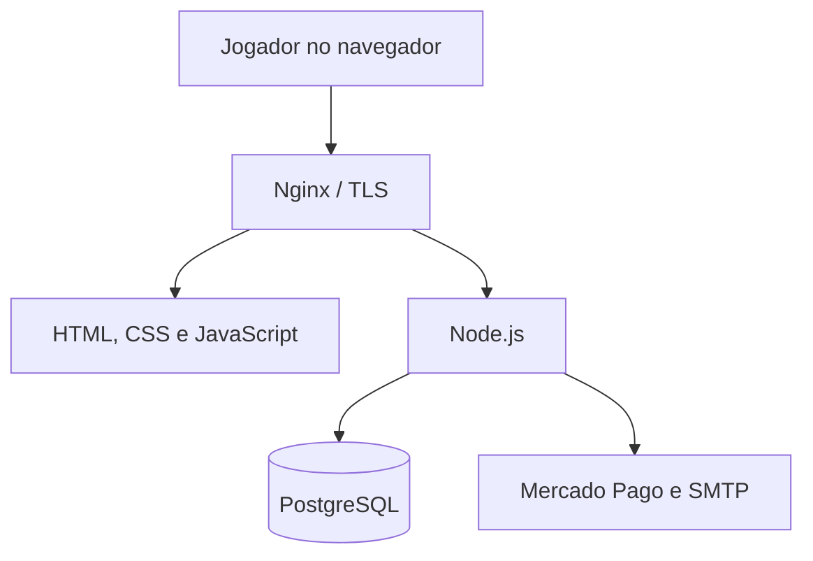

# Arquitetura do DBO IDLE

## Visão geral

O Nginx entregava os arquivos estáticos e encaminhava `/api` e `/ws` para o processo Node.js gerenciado pelo PM2. O backend mantinha a autoridade sobre operações persistentes e coordenava o estado online por WebSocket.

## Componentes

| Componente | Papel |
|---|---|
| Frontend estático | Interface, renderização, simulação local responsiva e envio de comandos |
| API HTTP | Contas, personagens, mercado, guildas, pagamentos e preferências |
| WebSocket | Presença, party, PvP, eventos e sincronização de gameplay |
| Autoridade do servidor | Validação de ações, combate, inventário e persistência segura |
| PostgreSQL | Fonte persistente de contas, sessões, personagens e economia |
| Mercado Pago | Criação, consulta e reconciliação de pagamentos |
| SMTP | Códigos de cadastro, recuperação de senha e testes operacionais |
| Nginx/PM2 | HTTPS, proxy reverso, reinício e monitoramento do processo |

## Fluxo de autenticação

1. O cliente envia cadastro ou login pela API.
2. O backend normaliza e valida os dados.
3. Senhas são tratadas no servidor e a sessão é persistida no PostgreSQL.
4. O navegador recebe um cookie de sessão protegido.
5. Requisições seguintes resolvem a conta a partir desse cookie.

## Fluxo de gameplay

1. O navegador carrega o estado persistente do personagem.
2. O cliente estabelece uma conexão WebSocket autenticada.
3. Ações sensíveis são avaliadas pela camada de autoridade do servidor.
4. Alterações aceitas são transmitidas aos participantes e persistidas.
5. Salvamentos periódicos e eventos de desconexão reduzem perda de progresso.

## Fluxo de pagamentos

1. O cliente solicita uma cotação e envia os dados necessários ao backend.
2. O backend utiliza credenciais mantidas exclusivamente em variáveis de ambiente.
3. A integração cria a ordem no provedor e registra o estado local.
4. Webhook e reconciliação ativa confirmam o pagamento.
5. Pontos são creditados de forma idempotente após a aprovação.

## Operação original

- Ubuntu 24.04 em VPS;
- Nginx com HTTPS e proxy para API/WebSocket;
- Node.js gerenciado pelo PM2;
- PostgreSQL local;
- firewall e acesso SSH endurecido;
- backups externos e validação por hash.

Configurações reais, endereços, certificados e segredos foram excluídos desta versão pública.
