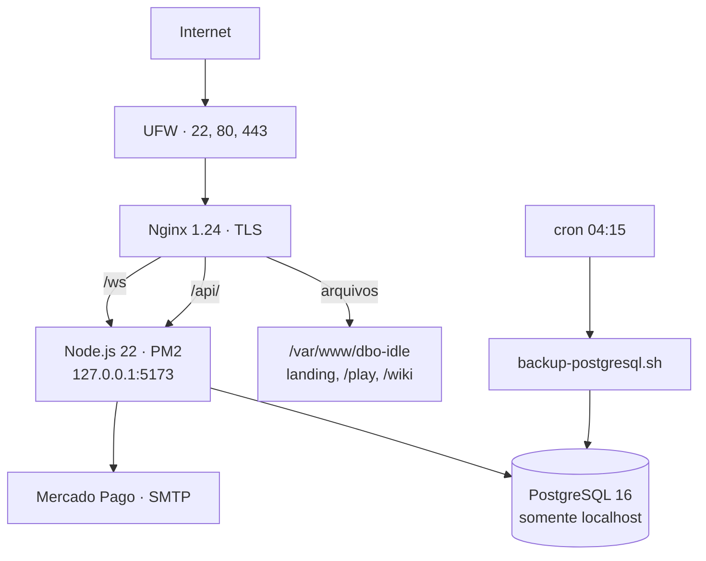

# Infraestrutura e operação

Este documento descreve como o DBO IDLE foi publicado e operado em uma VPS Ubuntu, com base na configuração real preservada no encerramento do ambiente, em 30 de agosto de 2026. Endereços IP, nome de usuário do sistema, identificadores de conta e dados de jogadores foram removidos, e o domínio aparece como `example.com` porque foi reservado para outro projeto; o restante é o que estava efetivamente em produção.

## Topologia



| Camada | Versão em produção |
|---|---|
| Sistema | Ubuntu 24.04 LTS |
| Servidor web | Nginx 1.24 |
| Runtime | Node.js 22.23 |
| Banco | PostgreSQL 16.15 |
| Supervisor de processo | PM2 (fork mode) |
| TLS | Let's Encrypt via Certbot (chave ECDSA) |
| Firewall | UFW |

## Nginx: entrega estática e proxy reverso

Um único server block resolvia quatro responsabilidades: redirecionar `www` para o domínio apex, servir os arquivos estáticos, encaminhar a API e encaminhar o WebSocket.

```nginx
server {
    server_name example.com www.example.com;

    if ($host = www.example.com) {
        return 301 https://example.com$request_uri;
    }

    root /var/www/dbo-idle;
    index index.html;
    client_max_body_size 20M;

    # o cliente do jogo é uma SPA: qualquer rota sob /play/ cai no index
    location ^~ /play/ {
        try_files $uri $uri/ /play/index.html;
    }

    location / {
        try_files $uri $uri/ /index.html;
    }

    location /api/ {
        proxy_pass http://127.0.0.1:5173;
        proxy_http_version 1.1;
        proxy_set_header Host              $host;
        proxy_set_header X-Real-IP         $remote_addr;
        proxy_set_header X-Forwarded-For   $proxy_add_x_forwarded_for;
        proxy_set_header X-Forwarded-Proto $scheme;
    }
}
```

Duas decisões visíveis aqui:

- **O Node nunca ficou exposto.** O processo escutava em `127.0.0.1:5173`, alcançável apenas pelo Nginx. O firewall nem precisava tratar essa porta, porque ela não existia de fora.
- **`try_files` separado para `/play/`.** A landing e a Wiki são páginas independentes; o jogo é uma aplicação de página única. Sem o bloco `^~ /play/`, um refresh dentro do jogo devolvia 404 em vez de recarregar o cliente.

## WebSocket: o timeout que mantém a sessão viva

O bloco `/ws` é o que mais separa esta configuração de um proxy genérico:

```nginx
location /ws {
    proxy_pass http://127.0.0.1:5173;
    proxy_http_version 1.1;

    proxy_set_header Upgrade    $http_upgrade;
    proxy_set_header Connection "upgrade";

    proxy_set_header Host              $host;
    proxy_set_header X-Real-IP         $remote_addr;
    proxy_set_header X-Forwarded-For   $proxy_add_x_forwarded_for;
    proxy_set_header X-Forwarded-Proto $scheme;

    proxy_read_timeout 86400;
    proxy_send_timeout 86400;
}
```

O padrão do Nginx é derrubar uma conexão ociosa em 60 segundos. Num jogo idle, é exatamente o comportamento errado: o jogador deixa a aba aberta, o combate roda, e nada trafega no socket por minutos. Sem `proxy_read_timeout 86400`, a sessão caía sozinha e o cliente reconectava em loop. O par `Upgrade` / `Connection: upgrade` com `proxy_http_version 1.1` é o que permite o handshake — os 163 upgrades registrados como HTTP 101 nos logs são a confirmação de que ele funcionava.

## TLS e renovação automática

O certificado foi emitido pelo Certbot com o plugin do Nginx, chave ECDSA, e a renovação ficou automática:

```nginx
listen 443 ssl;                # managed by Certbot
listen [::]:443 ssl ipv6only=on;
ssl_certificate     /etc/letsencrypt/live/example.com/fullchain.pem;
ssl_certificate_key /etc/letsencrypt/live/example.com/privkey.pem;
include             /etc/letsencrypt/options-ssl-nginx.conf;
ssl_dhparam         /etc/letsencrypt/ssl-dhparams.pem;
```

O bloco da porta 80 existia só para redirecionar: qualquer requisição HTTP recebia `301` para HTTPS, e o que não casasse com o domínio recebia `404` em vez de servir o site por engano.

A renovação rodava duas vezes por dia com espera aleatória, para não bater no rate limit da Let's Encrypt junto com o resto do mundo:

```cron
0 */12 * * * root test -x /usr/bin/certbot -a \! -d /run/systemd/system \
  && perl -e 'sleep int(rand(43200))' && certbot -q renew --no-random-sleep-on-renew
```

## PM2: o processo da aplicação

O backend rodava sob PM2, em **fork mode**, com um usuário de sistema sem privilégios — não como root.

| Parâmetro | Valor |
|---|---|
| Modo de execução | `fork_mode` |
| Interpretador | Node.js 22.23.2 |
| Diretório de trabalho | `/opt/dboidle/app/server` |
| Reinício automático | ativado |
| `watch` | desativado |
| Logs | `~/.pm2/logs/dbo-idle-out.log` e `-error.log` |
| Reinícios acumulados | 32 em 15 dias |
| Reinícios instáveis | 0 |

Os 32 reinícios foram deploys e ajustes de configuração, aplicados com `pm2 restart dbo-idle --update-env` — o contador de reinícios instáveis ficou em zero, ou seja, nenhum foi o PM2 recuperando um processo que morreu sozinho. `watch` desativado é deliberado: em produção, o reload tem que ser um ato explícito, não uma reação a arquivo tocado.

Um detalhe que só aparece na operação: `--update-env` é necessário porque o PM2 guarda o ambiente do momento em que o processo subiu. Sem essa flag, alterar uma variável no `.env` e reiniciar não muda nada, e o sintoma é uma credencial "que não atualiza".

## Firewall

UFW com política de negar tudo na entrada e permitir a saída, e apenas duas exceções:

```
Default: deny (incoming), allow (outgoing), disabled (routed)

To                          Action      From
22/tcp (OpenSSH)            ALLOW IN    Anywhere
80,443/tcp (Nginx Full)     ALLOW IN    Anywhere
22/tcp (OpenSSH (v6))       ALLOW IN    Anywhere (v6)
80,443/tcp (Nginx Full (v6))ALLOW IN    Anywhere (v6)
```

O PostgreSQL nunca apareceu nessa lista porque nunca escutou fora de `localhost`. Regras IPv6 espelham as IPv4 — um endereço v6 aberto por esquecimento é uma porta aberta como qualquer outra.

Isso não foi teoria. O servidor recebeu varredura automatizada desde o primeiro dia: a rota mais requisitada de toda a operação foi `/wp-admin/install.php`, com **4.371 tentativas** de scanners procurando WordPress. Todas terminaram em 404 servido pelo Nginx, sem chegar à aplicação.

## Banco e backup

O PostgreSQL rodava na própria VPS, acessível só por `localhost`, e um cron diário no usuário da aplicação gerava o dump:

```cron
15 4 * * * /opt/dboidle/backups/backup-postgresql.sh \
  >> /opt/dboidle/logs/backup-postgresql.log 2>&1
```

Redirecionar `stdout` e `stderr` para um log é o que diferencia um backup de uma esperança: sem isso, uma falha de cron vira um e-mail local que ninguém lê.

No encerramento, o banco tinha 10 MB e 20 tabelas. O esquema completo está em [`SCHEMA.sql`](SCHEMA.sql), sem nenhum registro de jogador.

## O que os logs mostraram

Os logs de erro do PM2, agregados no encerramento, registram o sistema se defendendo:

| Ocorrência | Vezes |
|---|---:|
| `[AUTHORITY] Rollback de level bloqueado` | 5 |
| `[MERCADO PAGO] Cartao bloqueado antes do provedor: Device ID ausente` | 1 |
| `[MERCADO PAGO] Falha ao reconciliar webhook: Payment not found` | 1 |
| `[EMAIL] Falha ao enviar codigo: SMTP nao configurado` | 1 |

Nenhum é um crash. Os quatro são caminhos de erro previstos disparando como deveriam: estado inválido do cliente rejeitado antes de persistir, pagamento recusado por validação local antes de gastar chamada externa, webhook órfão tratado como falha de reconciliação em vez de corromper o estado, e uma configuração ausente falhando com mensagem explícita em vez de em silêncio.

A aplicação também mantinha auditoria própria em banco: **576 eventos de segurança** e **540 registros de conexão**. Números completos em [Métricas de produção](METRICS.md).

## Encerramento

O ambiente foi um piloto fechado de 15 dias, sem divulgação. No desligamento, foram preservados com verificação SHA-256: o código do frontend e do backend, o dump do esquema, as configurações de Nginx, UFW, PM2 e cron, e as métricas de operação. Credenciais e dados de jogadores ficaram fora da versão pública — ver [Relatório de preparação pública](AUDIT-REPORT.md).

## O que eu faria diferente

- **Infraestrutura como código.** A VPS foi configurada à mão. Funcionou e ensinou o ciclo inteiro, mas reconstruir dependia de anotação. Um playbook ou um `docker-compose` versionado tornaria o ambiente reproduzível.
- **Observabilidade além do log de texto.** As métricas deste documento foram extraídas na hora do desligamento. Com métricas exportadas continuamente, elas seriam um painel em vez de uma arqueologia.
- **Backup verificado por restauração.** O dump diário existia e rodava; o que faltava era um teste automático restaurando o dump em um banco descartável, que é o único jeito de saber que um backup presta.
- **Deploy sem downtime.** Em fork mode com uma instância, todo restart é uma janela curta de indisponibilidade. Cluster mode com reload gradual resolveria.

Veja também [Arquitetura](ARCHITECTURE.md), [Decisões técnicas](TECHNICAL-DECISIONS.md) e [Métricas de produção](METRICS.md).
